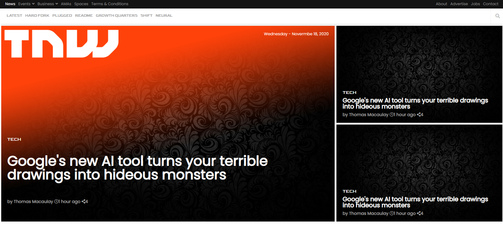

# The next web

> This project consists of replicating the The Next Web website putting emphasis on how it behaves differently depending on the size of the screen where the website is rendered.

## Built With

- HTML 5
- CSS 3

## Live Demo

[Live Demo Link](https://raw.githack.com/vichuge/6-the-next-web/feature/index.html)

## Getting Started

- Clone or download this project on your computer
- Open it with your favorite browser

## Authors

👤 **Victor Pacheco**

- GitHub: [@vichuge](https://github.com/vichuge)
- LinkedIn: [LinkedIn](https://www.linkedin.com/in/victor-pacheco-7946aab2/)

## 🤝 Contributing

Contributions, issues, and feature requests are welcome!

Feel free to check the [issues page](https://github.com/vichuge/6-the-next-web/issues).

## Show your support

Give a ⭐️ if you like this project!

## 📝 License

This project is [MIT](https://github.com/vichuge/6-the-next-web/blob/main/LICENSE) licensed.
